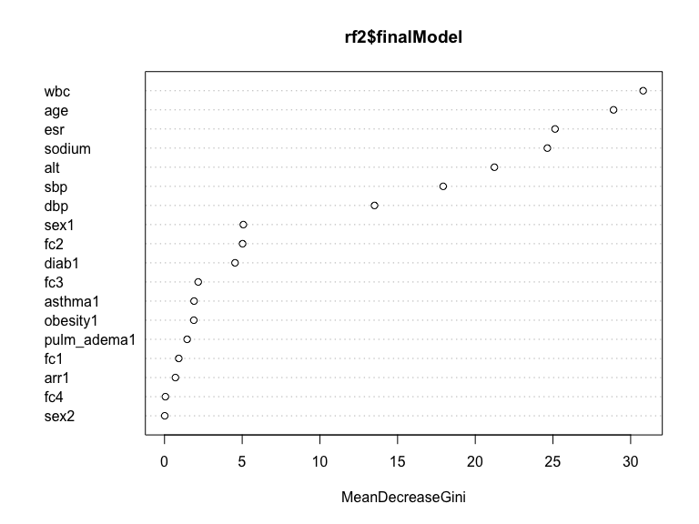

ml_hw7
================
Mohammad
2023-03-04

## Goal:

To predict 30-day readmission risk among patients currently hospitalized
for acute myocardial infarction using a smaple dataset.

The dataset (mi.data.final) consists of an ID variable, 14 features
describing clinical tests and comorbidities, and an indicator for
whether the individual was readmitted to the hospital within 30 days of
discharge.

The variables are as follows:

- `ID`: identifier
- `Age`: age at initial MI (years)
- `Sex`: Reported by patient 0-Male, 1-Female, 2-Non-binary/Other
- `sodium`: serum sodium (mmol/L)
- `ALT`: liver enzymes (IU/L)
- `WBC`: white blood cell count (billions/L)
- `ESR`: erythrocyte sedimentation rate
- `SBP`: systolic blood pressure at intake (mmHg)
- `DBP`: diastolic blood pressure at intake (mmHg)
- `Pulm.adema`: Pulmonary adema (1=Yes, 0=No)
- `FC`: functional class of angina pectoris in the last year
- `1`: there is no angina pectoris
- `2`: I FC
- `3`: II FC
- `4`: III FC
- `5`: IV FC
- `Arrythmia`: Presence of arrythmia (1=Yes, 0=No)
- `Diab`: Presence of diabetes (1=Yes, 0=No)
- `Obesity`: Presence of obesity (1=Yes, 0=No)
- `Asthma`: Presence of asthma (1=Yes, 0=No)
- `readmission`: Readmitted to hospital within 30 days (1=Yes, 0=No)

``` r
set.seed(123)

readmit <-
    read_csv("data/mi.data.csv") %>% 
    janitor::clean_names() %>% 
    select(- id) %>% 
    mutate(
        sex = factor(sex),
        pulm_adema = factor(pulm_adema),
        fc = factor(fc),
        arr = factor(arr),
        diab = factor(diab),
        obesity = factor(obesity),
        asthma = factor(asthma),
        readmission = factor(readmission)
    )
```

    ## Rows: 1700 Columns: 16
    ## ── Column specification ────────────────────────────────────────────────────────
    ## Delimiter: ","
    ## dbl (16): ID, Age, Sex, sodium, ALT, WBC, ESR, SBP, DBP, Pulm.adema, FC, Arr...
    ## 
    ## ℹ Use `spec()` to retrieve the full column specification for this data.
    ## ℹ Specify the column types or set `show_col_types = FALSE` to quiet this message.

``` r
Amelia::missmap(readmit)
```


``` r
str(readmit)
```

    ## tibble [1,700 × 15] (S3: tbl_df/tbl/data.frame)
    ##  $ age        : num [1:1700] 77 55 52 68 60 64 70 65 60 77 ...
    ##  $ sex        : Factor w/ 3 levels "0","1","2": 2 2 2 1 2 2 2 2 2 1 ...
    ##  $ sodium     : num [1:1700] 138 132 132 146 132 130 124 136 131 117 ...
    ##  $ alt        : num [1:1700] 0.9 0.38 0.3 0.75 0.45 0.45 0.3 0.38 0.3 0.38 ...
    ##  $ wbc        : num [1:1700] 8 7.8 10.8 10 8.3 7.2 11.1 6.2 6.2 6.9 ...
    ##  $ esr        : num [1:1700] 16 3 4 5 14 2 5 20 3 30 ...
    ##  $ sbp        : num [1:1700] 180 140 150 200 190 220 120 180 200 170 ...
    ##  $ dbp        : num [1:1700] 90 80 100 100 100 190 80 100 120 90 ...
    ##  $ pulm_adema : Factor w/ 2 levels "0","1": 1 1 1 1 1 1 1 1 1 1 ...
    ##  $ fc         : Factor w/ 5 levels "0","1","2","3",..: 2 1 1 1 1 3 3 2 1 1 ...
    ##  $ arr        : Factor w/ 2 levels "0","1": 1 1 1 1 1 1 1 1 1 1 ...
    ##  $ diab       : Factor w/ 2 levels "0","1": 1 1 1 1 1 1 1 1 1 2 ...
    ##  $ obesity    : Factor w/ 2 levels "0","1": 1 1 1 1 1 1 1 1 1 1 ...
    ##  $ asthma     : Factor w/ 2 levels "0","1": 1 1 1 1 1 1 1 1 1 1 ...
    ##  $ readmission: Factor w/ 2 levels "0","1": 1 1 1 1 1 1 1 1 1 1 ...

``` r
summary(readmit[ , "readmission"])
```

    ##  readmission
    ##  0:1541     
    ##  1: 159

For this assignment, you will implement the pipeline you sketched out
with your group. As a reminder, your pipeline should include tasks for
data preparation, any partitioning or resampling you deem necessary, any
tuning of hyperparameters, and explicit evaluation metrics you will
examine in order to choose your optimal algorithm. You can choose to
examine different algorithms than elastic net and random forest, but you
must compare at least two algorithms and one should be an ensemble
algorithm.

``` r
train.index <- 
    readmit$readmission %>% 
    createDataPartition(p = 0.7, list = FALSE)

train_df <- 
    readmit[train.index, ]

test_df <- 
    readmit[-train.index, ]
```

Elastic net

``` r
set.seed(123)

enet1 <-
    train(readmission ~., data = train_df, method = "glmnet", 
          trControl = trainControl("cv", number = 10, sampling = "up"), 
          preProc = c("center", "scale"), tuneLength = 10, metric="Accuracy")

confusionMatrix(enet1)
```

    ## Cross-Validated (10 fold) Confusion Matrix 
    ## 
    ## (entries are percentual average cell counts across resamples)
    ##  
    ##           Reference
    ## Prediction    0    1
    ##          0 55.8  4.3
    ##          1 34.8  5.1
    ##                             
    ##  Accuracy (average) : 0.6096

``` r
set.seed(123)
alpha <- seq(0.1, 1, length = 10)
lambda <- 10^seq(-3, 3, length = 100)

enet2 <-
    train(readmission ~., data = train_df, method = "glmnet", 
          trControl = trainControl("cv", number = 10, sampling = "up"), 
          preProc = c("center", "scale"),  tuneGrid = expand.grid(alpha = alpha, lambda = lambda), 
          metric="Accuracy")

confusionMatrix(enet2)
```

    ## Cross-Validated (10 fold) Confusion Matrix 
    ## 
    ## (entries are percentual average cell counts across resamples)
    ##  
    ##           Reference
    ## Prediction    0    1
    ##          0 55.5  3.9
    ##          1 35.1  5.5
    ##                             
    ##  Accuracy (average) : 0.6104

``` r
enet1$bestTune
```

    ##    alpha    lambda
    ## 54   0.7 0.0045812

``` r
enet1$results
```

    ##    alpha       lambda  Accuracy      Kappa AccuracySD    KappaSD
    ## 1    0.1 6.963016e-05 0.6019404 0.06010178 0.03049879 0.05136502
    ## 2    0.1 1.608547e-04 0.6019404 0.06010178 0.03049879 0.05136502
    ## 3    0.1 3.715952e-04 0.6019404 0.06010178 0.03049879 0.05136502
    ## 4    0.1 8.584332e-04 0.6019404 0.06010178 0.03049879 0.05136502
    ## 5    0.1 1.983092e-03 0.6019404 0.06010178 0.03049879 0.05136502
    ## 6    0.1 4.581200e-03 0.6002526 0.05929550 0.03165671 0.05216644
    ## 7    0.1 1.058317e-02 0.5968982 0.05752940 0.03226597 0.05251273
    ## 8    0.1 2.444849e-02 0.6027737 0.06101464 0.03103787 0.05555757
    ## 9    0.2 6.963016e-05 0.6002314 0.07225914 0.03760609 0.05127731
    ## 10   0.2 1.608547e-04 0.6002314 0.07225914 0.03760609 0.05127731
    ## 11   0.2 3.715952e-04 0.6002314 0.07225914 0.03760609 0.05127731
    ## 12   0.2 8.584332e-04 0.6002314 0.07225914 0.03760609 0.05127731
    ## 13   0.2 1.983092e-03 0.5993911 0.06907477 0.03799581 0.04968102
    ## 14   0.2 4.581200e-03 0.6002243 0.06954139 0.03955016 0.04932835
    ## 15   0.2 1.058317e-02 0.6027596 0.07375333 0.03638086 0.04909140
    ## 16   0.2 2.444849e-02 0.6078160 0.07052607 0.03166908 0.04852268
    ## 17   0.3 6.963016e-05 0.5934671 0.07794197 0.04034140 0.05287273
    ## 18   0.3 1.608547e-04 0.5934671 0.07794197 0.04034140 0.05287273
    ## 19   0.3 3.715952e-04 0.5934671 0.07794197 0.04034140 0.05287273
    ## 20   0.3 8.584332e-04 0.5934671 0.07794197 0.04034140 0.05287273
    ## 21   0.3 1.983092e-03 0.5943074 0.07840171 0.03952152 0.05300056
    ## 22   0.3 4.581200e-03 0.5960021 0.07892184 0.03483532 0.05110209
    ## 23   0.3 1.058317e-02 0.6027390 0.08026759 0.03355895 0.04983772
    ## 24   0.3 2.444849e-02 0.6052811 0.08807907 0.03439756 0.05007905
    ## 25   0.4 6.963016e-05 0.6052739 0.07363966 0.03998384 0.03923038
    ## 26   0.4 1.608547e-04 0.6052739 0.07363966 0.03998384 0.03923038
    ## 27   0.4 3.715952e-04 0.6052739 0.07363966 0.03998384 0.03923038
    ## 28   0.4 8.584332e-04 0.6052739 0.07363966 0.03998384 0.03923038
    ## 29   0.4 1.983092e-03 0.6052739 0.07323615 0.03695488 0.03574803
    ## 30   0.4 4.581200e-03 0.6077878 0.08071516 0.04049367 0.04001523
    ## 31   0.4 1.058317e-02 0.6069686 0.07370082 0.03478504 0.03576705
    ## 32   0.4 2.444849e-02 0.6069545 0.08273809 0.03476153 0.04120182
    ## 33   0.5 6.963016e-05 0.6010791 0.07871315 0.03657640 0.05184309
    ## 34   0.5 1.608547e-04 0.6010791 0.07871315 0.03657640 0.05184309
    ## 35   0.5 3.715952e-04 0.6010791 0.07871315 0.03657640 0.05184309
    ## 36   0.5 8.584332e-04 0.6010791 0.07871315 0.03657640 0.05184309
    ## 37   0.5 1.983092e-03 0.6002387 0.07546805 0.03890692 0.04572592
    ## 38   0.5 4.581200e-03 0.6027456 0.07711164 0.04211621 0.04630573
    ## 39   0.5 1.058317e-02 0.5985439 0.07173714 0.04172006 0.04647498
    ## 40   0.5 2.444849e-02 0.5977108 0.08051231 0.04058355 0.04450804
    ## 41   0.6 6.963016e-05 0.5926545 0.06333574 0.04894180 0.05573873
    ## 42   0.6 1.608547e-04 0.5926545 0.06333574 0.04894180 0.05573873
    ## 43   0.6 3.715952e-04 0.5926545 0.06333574 0.04894180 0.05573873
    ## 44   0.6 8.584332e-04 0.5926545 0.06333574 0.04894180 0.05573873
    ## 45   0.6 1.983092e-03 0.5951614 0.06123568 0.04803763 0.05467703
    ## 46   0.6 4.581200e-03 0.5993702 0.06351163 0.04630581 0.05521321
    ## 47   0.6 1.058317e-02 0.6002248 0.06947607 0.04243172 0.05559693
    ## 48   0.6 2.444849e-02 0.6019054 0.06767961 0.03612830 0.03570272
    ## 49   0.7 6.963016e-05 0.6086563 0.06824180 0.03476802 0.04560706
    ## 50   0.7 1.608547e-04 0.6086563 0.06824180 0.03476802 0.04560706
    ## 51   0.7 3.715952e-04 0.6086563 0.06824180 0.03476802 0.04560706
    ## 52   0.7 8.584332e-04 0.6078160 0.06780409 0.03585243 0.04557721
    ## 53   0.7 1.983092e-03 0.6086633 0.06463174 0.03013340 0.03898000
    ## 54   0.7 4.581200e-03 0.6094966 0.06512693 0.02945400 0.03888003
    ## 55   0.7 1.058317e-02 0.6044615 0.06614964 0.02920425 0.03583203
    ## 56   0.7 2.444849e-02 0.5993984 0.07019750 0.03962224 0.04759553
    ## 57   0.8 6.963016e-05 0.6061002 0.06577386 0.03911393 0.04711543
    ## 58   0.8 1.608547e-04 0.6061002 0.06577386 0.03911393 0.04711543
    ## 59   0.8 3.715952e-04 0.6061002 0.06577386 0.03911393 0.04711543
    ## 60   0.8 8.584332e-04 0.6069405 0.06350415 0.04074955 0.04407530
    ## 61   0.8 1.983092e-03 0.6077878 0.06751331 0.04128354 0.04683354
    ## 62   0.8 4.581200e-03 0.6035790 0.06817421 0.03901555 0.04944664
    ## 63   0.8 1.058317e-02 0.5985509 0.05927908 0.03535242 0.04790400
    ## 64   0.8 2.444849e-02 0.5926898 0.07076033 0.03536923 0.05561801
    ## 65   0.9 6.963016e-05 0.6060859 0.06961690 0.03529187 0.04412895
    ## 66   0.9 1.608547e-04 0.6060859 0.06961690 0.03529187 0.04412895
    ## 67   0.9 3.715952e-04 0.6060859 0.06961690 0.03529187 0.04412895
    ## 68   0.9 8.584332e-04 0.6052456 0.06922906 0.03541931 0.04492498
    ## 69   0.9 1.983092e-03 0.6052527 0.06929856 0.03324131 0.04614585
    ## 70   0.9 4.581200e-03 0.6027317 0.06811578 0.03530012 0.04773243
    ## 71   0.9 1.058317e-02 0.6069264 0.07583044 0.03507863 0.05408224
    ## 72   0.9 2.444849e-02 0.6019264 0.08267540 0.03583825 0.04869006
    ## 73   1.0 6.963016e-05 0.6052525 0.06932377 0.04370349 0.04836312
    ## 74   1.0 1.608547e-04 0.6052525 0.06932377 0.04370349 0.04836312
    ## 75   1.0 3.715952e-04 0.6052525 0.06932377 0.04370349 0.04836312
    ## 76   1.0 8.584332e-04 0.6069403 0.07017923 0.04153130 0.04839756
    ## 77   1.0 1.983092e-03 0.6086280 0.07735363 0.04168504 0.04723951
    ## 78   1.0 4.581200e-03 0.6069332 0.07645992 0.04467139 0.05111332
    ## 79   1.0 1.058317e-02 0.6044405 0.07529582 0.04024064 0.05210979
    ## 80   1.0 2.444849e-02 0.5977104 0.07877007 0.04689196 0.05142181

``` r
varImp(enet1)
```

    ## glmnet variable importance
    ## 
    ##              Overall
    ## dbp         100.0000
    ## fc3          75.0537
    ## fc2          73.4092
    ## pulm_adema1  48.5268
    ## age          44.0701
    ## fc4          36.4732
    ## arr1         29.7136
    ## wbc          28.7958
    ## fc1          13.2217
    ## asthma1      12.9962
    ## sex1         12.9872
    ## diab1         7.0054
    ## sex2          6.4262
    ## alt           5.6055
    ## sbp           4.5647
    ## obesity1      3.9541
    ## esr           0.5425
    ## sodium        0.0000

``` r
plot(varImp(enet1))
```


Random forest

``` r
#Firt model trying three different values for mtry, 10 forld cross validation and up sampling
set.seed(123)

mtry <- c(ncol(train_df)-1, sqrt(ncol(train_df)-1), 0.5*ncol(train_df)-1)
mtrygrid <- expand.grid(.mtry = round(mtry))

rf1 <- 
    train(readmission ~., data = train_df, method = "rf", metric = "Accuracy", 
          tuneGrid = mtrygrid, trControl = trainControl("cv", number = 10, sampling = "up"),
          ntree = 100)

confusionMatrix(rf1)
```

    ## Cross-Validated (10 fold) Confusion Matrix 
    ## 
    ## (entries are percentual average cell counts across resamples)
    ##  
    ##           Reference
    ## Prediction    0    1
    ##          0 89.8  9.4
    ##          1  0.8  0.0
    ##                             
    ##  Accuracy (average) : 0.8984

``` r
varImpPlot(rf1$finalModel)
```


``` r
#Second model using the same values of mtry but no cross validation, no up sampling, using bootstrapping defaults 
set.seed(123)

rf2 <- 
    train(readmission ~., data = train_df, method = "rf", metric = "Accuracy", 
          tuneGrid = mtrygrid, 
          ntree = 100)

confusionMatrix(rf2)
```

    ## Bootstrapped (25 reps) Confusion Matrix 
    ## 
    ## (entries are percentual average cell counts across resamples)
    ##  
    ##           Reference
    ## Prediction    0    1
    ##          0 90.7  9.2
    ##          1  0.1  0.0
    ##                             
    ##  Accuracy (average) : 0.9068

``` r
#Trying the second model with a larger number of trees


#rf$results
#rf$bestTune
rf2$finalModel
```

    ## 
    ## Call:
    ##  randomForest(x = x, y = y, ntree = 100, mtry = param$mtry) 
    ##                Type of random forest: classification
    ##                      Number of trees: 100
    ## No. of variables tried at each split: 4
    ## 
    ##         OOB estimate of  error rate: 9.49%
    ## Confusion matrix:
    ##      0 1  class.error
    ## 0 1078 1 0.0009267841
    ## 1  112 0 1.0000000000

``` r
varImp(rf2)
```

    ## rf variable importance
    ## 
    ##              Overall
    ## wbc         100.0000
    ## age          93.8066
    ## esr          81.5853
    ## sodium       79.9756
    ## alt          68.9068
    ## sbp          58.1965
    ## dbp          43.8465
    ## sex1         16.4285
    ## fc2          16.2708
    ## diab1        14.6889
    ## fc3           6.9947
    ## asthma1       6.1205
    ## obesity1      6.0741
    ## pulm_adema1   4.6809
    ## fc1           2.9296
    ## arr1          2.2333
    ## fc4           0.1355
    ## sex2          0.0000

``` r
plot(varImp(rf2))
```


``` r
varImpPlot(rf2$finalModel)
```



Gradient boosting

``` r
set.seed(123)

#First model where all hyperparameters are being held constant,  no cross-validation, using bootstrapping default

gbm1 <- 
    train(readmission ~., data = train_df, method = "gbm", distribution = "bernoulli", verbose = F,
          tuneGrid = data.frame(.n.trees = 1000, .shrinkage = 0.001, .interaction.depth = 1, .n.minobsinnode = 10))

gbm1
```

    ## Stochastic Gradient Boosting 
    ## 
    ## 1191 samples
    ##   14 predictor
    ##    2 classes: '0', '1' 
    ## 
    ## No pre-processing
    ## Resampling: Bootstrapped (25 reps) 
    ## Summary of sample sizes: 1191, 1191, 1191, 1191, 1191, 1191, ... 
    ## Resampling results:
    ## 
    ##   Accuracy   Kappa
    ##   0.9076105  0    
    ## 
    ## Tuning parameter 'n.trees' was held constant at a value of 1000
    ## 
    ## Tuning parameter 'shrinkage' was held constant at a value of 0.001
    ## 
    ## Tuning parameter 'n.minobsinnode' was held constant at a value of 10

``` r
confusionMatrix(gbm1)
```

    ## Bootstrapped (25 reps) Confusion Matrix 
    ## 
    ## (entries are percentual average cell counts across resamples)
    ##  
    ##           Reference
    ## Prediction    0    1
    ##          0 90.8  9.2
    ##          1  0.0  0.0
    ##                             
    ##  Accuracy (average) : 0.9076

``` r
varImp(gbm1)
```

    ## gbm variable importance
    ## 
    ##              Overall
    ## dbp         100.0000
    ## age          75.5862
    ## sbp          52.3465
    ## wbc          42.1394
    ## sodium       40.9993
    ## esr          24.6723
    ## fc2          23.4898
    ## fc3          20.5976
    ## alt           4.1489
    ## diab1         4.1347
    ## sex1          2.3333
    ## obesity1      0.4997
    ## pulm_adema1   0.1676
    ## arr1          0.0000
    ## sex2          0.0000
    ## fc1           0.0000
    ## fc4           0.0000
    ## asthma1       0.0000

``` r
#Second model where I tune hyperparameters
set.seed(123)

#only running a few bootstrapped samples
control <- trainControl(number = 10)
gridgbm <- expand.grid(n.trees=(0:10)*100, shrinkage=c(0.01, 0.001), interaction.depth=c(1,3), n.minobsinnode=10)

gbm2 <- train(readmission ~., data=train_df, method="gbm", distribution="bernoulli", verbose=F, tuneGrid=gridgbm, trControl = control)

confusionMatrix(gbm2)
```

    ## Bootstrapped (10 reps) Confusion Matrix 
    ## 
    ## (entries are percentual average cell counts across resamples)
    ##  
    ##           Reference
    ## Prediction    0    1
    ##          0 90.5  9.5
    ##          1  0.0  0.0
    ##                             
    ##  Accuracy (average) : 0.9047

``` r
#varImp(gbm2)
```

You will turn in a knit document that shows both code and output for
your pipeline. This should include the evaluation metrics used to
compare algorithms, the final evaluation metrics used to report
performance of the final model and any generated output detailing the
features most important for the prediction. You can continue to work
together in groups, but each individual must turn in their own knit
document.

``` r
set.seed(123)

#Make predictions in test set
preds <- predict(gbm1, test_df)

#Get evaluation metrics from test set
confusionMatrix(preds, test_df$readmission, positive = "1")
```

    ## Confusion Matrix and Statistics
    ## 
    ##           Reference
    ## Prediction   0   1
    ##          0 462  47
    ##          1   0   0
    ##                                           
    ##                Accuracy : 0.9077          
    ##                  95% CI : (0.8791, 0.9314)
    ##     No Information Rate : 0.9077          
    ##     P-Value [Acc > NIR] : 0.5387          
    ##                                           
    ##                   Kappa : 0               
    ##                                           
    ##  Mcnemar's Test P-Value : 1.949e-11       
    ##                                           
    ##             Sensitivity : 0.00000         
    ##             Specificity : 1.00000         
    ##          Pos Pred Value :     NaN         
    ##          Neg Pred Value : 0.90766         
    ##              Prevalence : 0.09234         
    ##          Detection Rate : 0.00000         
    ##    Detection Prevalence : 0.00000         
    ##       Balanced Accuracy : 0.50000         
    ##                                           
    ##        'Positive' Class : 1               
    ## 
